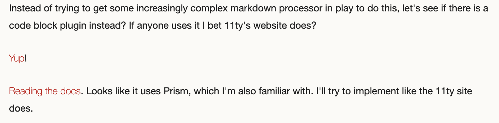

1. Static Site Generator that can build the blog and let me host it on Github Pages
2. I want to write posts in Markdown because I'm lazy, it's easy, and it is how I take notes now.
3. I don't want to spend a ton of time doing design work. I'm doing complicated designs for other projects, so I want to pull a theme I like that I can rely on someone else to keep up.
4. Once it gets going, I want template changes to be easy.
5. It should be as easy as Jekyll, so I need to be able to build it using GitHub Actions, where I can just commit a template change or Markdown file and away it goes. If I can't figure this out than fk it, just use Jekyll.
6. I require it to be used by a significant percent of my professional peers so I can get easy answers when something goes wrong.
7. I want source maps. This is a dev log site which means whatever I do with it should be easy for other developers to read.

- [ ] Also [the sitemap plugin](https://www.npmjs.com/package/@quasibit/eleventy-plugin-sitemap) looks cool. Should grab that later.

- [ ] So does the [reading time one](https://www.npmjs.com/package/eleventy-plugin-reading-time).

- [ ] Also [this TOC plugin](https://github.com/jdsteinbach/eleventy-plugin-toc/blob/master/src/BuildTOC.js) mby?

- [ ] Use [Data Deep Merge](https://www.11ty.dev/docs/data-deep-merge/) in this blog.

- [ ] Decide if I want to render the CSS fancier than just a base file and do per-template splitting.

<s>

- [ ] Can I use the template inside of dinky that already exists instead of copy/pasting it?

</s>

- [ ] Is there a way to have permalinks to posts contain metadata without organizing them into subfolders?

- [ ] How do I cachebreak files on the basis of new build events? Datetime? `site.github.build_revision` is how Jekyll accomplishes this, but is there a way to push that into the build process for 11ty?

- [ ] Make link text look less shitty. It looks like it is a whole, lighter, font.

- [x] Code blocks do not have good syntax highlighting. I want good syntax highlighting.

# Day 5

Ok, yesterday I didn't have that much time to work, but today I'm feeling as good as I can after having my main battery and a whole bunch of USB sticks, a Yubi key, and my main external Anker power battery robbed out of the back of a rental car in San Antonio yesterday.

Good news, finally a check mark on my ever-expanding scope list. Some bad news for the task list as well, in that I'm now 99% sure I can't just pull the template from the dinky submodule. I think there are just too significant a set of differences between Jekyll and Nunjucks. I could explore more similar templating languages, but getting better at Nunjucks is part of the point of all this, so I'm going to dismiss that from my work scope for now.

So, since it hasn't been a great 24hs IRL, let's see if I can harvest a few more easy wins.

How do the GitHub variables work for cachebreaking? That seems like a potentially non-obvious but relatively easy win. A-searching we do go.

Interesting to see someone [handling their build via Travis](https://snook.ca/archives/servers/deploying-11ty-to-gh-pages), good to remember.

Ok, that was unexpected. No one seems to have asked this question? Maybe it just works? I guess I'll have to wait to deploy in order to see. Moving on to something entirely in my hands, let's make the links look less shitty.

Let me show you the problem.

Oh, wait, need to get the image folder working first...

Ok, following the pattern of posts the `img` folder should be inside of `src`. Gotta fix the passthrough `eleventyConfig.addPassthroughCopy("src/img", "img");`.

Oh, I actually [don't need to be that explicit](https://www.11ty.dev/docs/copy/#how-passthrough-file-copy-handles-input-directories). `eleventyConfig.addPassthroughCopy("src/img", "img");` works just fine.

Hmmm, I could do full URLs, but this is actually one of the things I hate about Jekyll.

Ugh... [it looks like the general strategy in GitHub issues is to copy images to be relative to the folders of the associated posts](https://github.com/11ty/eleventy/issues/379). That's... meh. I dislike it intensely. What if I want to reuse the image? Now I have multiples. One image, one URL IMHO.

Ok, looks like I'm not the only one fiddling around with this, [someone else wrote all the annoying regexes for me in a markdown-it plugin](https://www.npmjs.com/package/markdown-it-replace-link).

There's [no way to really get the base URL](https://www.11ty.dev/docs/data-eleventy-supplied/), but at least I can do it [DRY](https://en.wikipedia.org/wiki/Don%27t_repeat_yourself).

<aside>

(I also saw [how 11ty pulls from the Github API on build](https://www.11ty.dev/docs/quicktips/eliminate-js/), which may be useful if I need to use [that sort of info](https://docs.github.com/en/rest/reference/repos#get) for cachebreaking later.)

</aside>

This comes from that whole annoying school of "native link styles are ugly so let's change them as much as possible and try to use some other thing to indicate they are links."

That school is one I do not attend. Clear and legible UX has to build on top of standards of design the user is familiar with lest a site confuse the reader. I can give any theme some room, you can remove underlines, or change the color to something other than close-to-link-blue, but both?! Nien.

Huh... first things first... that Sass folder should really be in `src`.

Ok, now to set up a `user` overwrite to be the last file in the Sass compile process, and t/f the one that overrides general site-level stuff. Let's fix it to a blue color and remove that *very* annoying light weight on the font.

Much better.

Oh, I want to make those checkboxes show up correctly. Bet there's a markdown-it plugin I can use. It looks like there are 2 possible node modules, [a more used one with some unresolved PRs and ignored issues](https://www.npmjs.com/package/markdown-it-task-checkbox) and [a barely used one that correctly makes checkboxes readonly](https://www.npmjs.com/package/markdown-it-todo). It might be less popular, but I'm going with the version that works the way I want right out of the box. It also happens to be a very simple plugin, so if it goes wrong, I can always hack at it.

Looks good!

`git commit -am "Adding days 4 and 5 progress and notes"`

